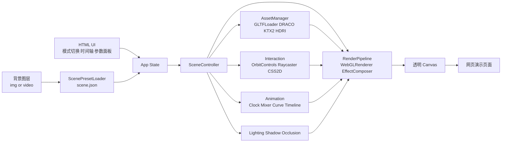

# 《口袋宇宙实验台》网页大作业设计与开发方案

## 执行摘要

推荐做《口袋宇宙实验台》：用 Three.js 在真实场景图上叠加可交互微缩天体装置。它最稳、最易开源、最适合 8 周内做出兼顾震撼观感与网页交互的课程演示。 citeturn17search7turn18search6turn8search0turn7search6

## 方案定位与技术选型

这个题目真正适合做成一个“图像增强式 Web 演示”，而不是把时间主要花在浏览器摄像头、设备差异和真 AR 兼容性上。最稳妥的课程化表达，是把“真实场景图 + 可交互三维内容增强”做成一个可复用框架：背景图来自桌面、教室、实验台、校园角落；主角则是一个微缩太阳系或能量装置。这样可以把作业要求中的“指定位置放置”“沿路径动态增强”“三个虚拟物体动态关系”自然映射为锚点放置、轨道/样条动画与太阳—地球—月亮层级关系。与此同时，Three.js 官方中文手册已经覆盖安装、控制器、后处理、阴影、响应式与 WebGPU 迁移路线，glTF 也是 Khronos 的开放标准，适合课程作业快速落地并公开发布。 citeturn17search6turn17search7turn18search6turn19search11turn17search0turn10search0turn10search1turn22search14

下表中的“学习曲线 / MVP 风险 / 开源友好度 / 推荐度”是基于官方文档与当前浏览器能力的综合判断，而不是单纯的个人喜好。核心依据包括：Three.js 的中文手册与 glTF/后处理/阴影支持，Babylon.js 的 PBR/GlowLayer/Inspector/WebGPU 支持，Unity Web 平台的桌面导向与技术限制，以及 MDN 和 Can I use 对 WebGPU 兼容性的说明。 citeturn29view0turn5search2turn5search4turn5search5turn5search11turn7search6turn7search14turn8search0turn8search1turn22search14

| 路线 | 官方依据 | 学习曲线 | 视觉潜力 | 移动端网页演示 | 开源友好 | 8 周 MVP 风险 | 结论 |
|---|---|---:|---:|---:|---:|---:|---|
| **Three.js + WebGL** | 官方中文手册完整；附加组件需显式导入；GLTFLoader 支持 Draco / KTX2 / Meshopt；可逐步过渡到 WebGPURenderer。MIT 许可。 citeturn17search7turn29view0turn29view1turn29view2turn12search0turn22search14 | 中 | 高 | 高 | 高 | **低** | **最推荐** |
| **Babylon.js** | 官方文档强调引擎开源；PBR、GlowLayer、Inspector、WebGPU 均有官方支持。Apache-2.0。 citeturn12search10turn5search4turn5search5turn5search2turn5search11turn12search1 | 中 | 高 | 高 | 高 | 中 | 备选 |
| **Unity WebGL** | 可自定义 Web 模板，但官方明确列出 Web 技术限制；浏览器兼容性以桌面为主，移动端不支持。 citeturn7search4turn7search7turn7search8turn7search6turn7search14 | 中高 | 很高 | 低 | 中 | **高** | 仅团队已有 Unity 经验时考虑 |
| **原生 WebGPU 主线** | MDN 将其标为实验性技术，兼容性需单独检查；Three.js 的 WebGPURenderer 虽可回退 WebGL2，但 WebGPU 本体仍不是最稳妥的课程演示主线。 citeturn8search0turn8search1turn22search14turn27search8 | 高 | 很高 | 中 | 中高 | **高** | 只做实验分支 |

**最终推荐**：主线采用 **Three.js + WebGLRenderer + glTF/GLB + GLSL + Vite + 纯静态部署**；同时预留一个 `rendererFactory`，在未来把部分自定义效果迁移到 `WebGPURenderer` 分支。理由很直接：WebGL 仍是现代网页 3D 演示最稳的兼容层，Three.js 中文资料完整，GLTFLoader、OrbitControls、后处理、阴影、CSS2D、响应式都由官方体系覆盖，而 Unity Web 平台对移动端的限制会直接削弱你“网页演示”的展示面。 citeturn9search0turn17search7turn28search8turn18search6turn19search11turn23search0turn17search0turn7search6turn7search14

建议的最小技术栈如下：前端用 **TypeScript + Vite**；3D 引擎用 **Three.js**；资源格式统一为 **glTF/GLB**；压缩用 **Draco + KTX2**；UI 以普通 HTML/CSS 为主，补充 **CSS2DRenderer** 做场景标签，补充 **lil-gui** 做演示调参面板，补充 **stats.js** 做性能监控。Vite 官方说明 `vite build` 默认输出可直接静态托管的生产包，lil-gui 与 stats.js 都采用 MIT 许可，适合教学开源仓库直接整合。 citeturn20search0turn20search4turn17search7turn29view0turn40view0turn23search0turn31search1turn32search0

## 功能设计与交互流程

最推荐的作品形态不是“一个孤零零的 3D 模型贴在图片上”，而是一个带故事感和表演性的网页作品：用户打开页面后，先选择内置场景图或上传自己的照片；接着点击图中锚点，将一套“微缩宇宙装置”放到桌面或空地上；然后通过滚轮/双指缩放、拖拽旋转、时间轴拖动与镜头预设，在“科学演示模式”和“电影展示模式”之间切换。交互层建议直接采用 OrbitControls 的桌面与触控手势能力，再用 Raycaster 处理点击放置和对象选中，用 CSS2DRenderer 处理标签与提示，这三部分都已有官方文档支持。 citeturn28search8turn26search0turn26search5turn23search0

| 模块 | MVP 必做 | 扩展功能 | 课程价值 |
|---|---|---|---|
| 背景场景 | 内置 2 张高质量背景图；支持 1 张用户上传图 | 视频背景、实时摄像头分支 | 对应“场景图像内容增强” |
| 锚点放置 | 点击地面预设区域放置装置 | 自动吸附、锚点拖动 | 对应“放置在指定位置” |
| 三体系统 | 太阳—地球—月亮层级关系 | 多编队卫星 / 粒子环 / 彗尾 | 对应“三个虚拟物体动态关系” |
| 轨道动画 | 圆轨道 + 悬浮起伏 + 自转 | CatmullRom 样条路径、镜头沿轨飞行 | 对应“沿路径动态增强” |
| 视觉表现 | 阴影、接触阴影、辉光、景深、色彩分级 | 体积光、镜头光晕、局部雾效 | 对应图形学表现力 |
| 网页交互 | 旋转、缩放、平移、暂停、重置、时间倍率 | 参数面板、镜头预设、对比切换 | 对应网页可交互性 |
| 说明系统 | HTML 标签 / 图例 / 操作提示 | 教学讲解模式、注释层 | 适合答辩演示 |
| 分享导出 | 截图保存 PNG | GIF、海报模式、二维码链接 | 便于课堂展示 |

建议的用户流程可以压缩为一条非常顺的演示路径：进入页面后先出现一张“场景增强前”的背景图，点击“开始增强”后进入放置模式；鼠标或手指在图片中的目标区域点一下，虚拟装置落地并自动播放默认镜头；随后用户可以旋转观察、拖动时间轴、打开“电影模式”看景深与辉光、打开“科学模式”看轨道与层级标签；最后点击“前后对比”或“保存截图”结束。这个流程足够短，适合课堂答辩，也足够完整，能把图形学、交互和可视化叙事同时讲清楚。  

更具体地说，MVP 页面建议包含五块区域：上方是标题与一句话描述，中部是背景图与透明 3D 画布，下方是时间轴与模式切换，右上角是参数与质量级别入口，左下角是操作图例。这样既保留了网页化的阅读感，又不会把全部逻辑塞进一个黑盒画布里，老师更容易看出你在做“网页交互式图形作品”，而不是“把游戏引擎硬塞进网页”。  

## 技术架构与关键实现

技术上最关键的设计，不是“特效堆多少”，而是把项目做成一个可复用的 **场景增强框架**。具体做法是：背景图继续使用原生 DOM 图层；Three.js 的透明 canvas 叠在上方；每个场景都对应一份 `scene.json` 元数据，记录锚点、相机初始参数、阴影接收平面、遮挡代理模型、默认镜头与后处理参数。这样预设场景可以做高质量演示，上传场景也能优雅降级。Three.js 官方文档说明附加组件需要显式导入，GLTFLoader 支持 glTF 2.0 以及 Draco、KTX2、Meshopt 等压缩扩展，DRACOLoader 也建议复用单实例，这非常适合做成清晰的模块化前端工程。 citeturn17search7turn29view0turn29view1turn29view2turn40view0



**渲染管线**建议采用透明 `WebGLRenderer` + `EffectComposer`。Three.js 官方说明 `OutputPass` 应放在大多数后处理链的末尾，负责 tone mapping 与颜色空间转换；`BokehPass` 可运行时调节焦点与光圈；`UnrealBloomPass` 适合做太阳核心与能量边缘的辉光；`SMAAPass` 按官方文档应放在 `OutputPass` 之前。Three.js 中文手册也明确说明可以用 `ShaderPass` 挂接自定义 GLSL 后处理。 citeturn18search0turn18search1turn18search2turn25search1turn18search16turn18search6turn25search11

```ts
import * as THREE from 'three';
import { OrbitControls } from 'three/addons/controls/OrbitControls.js';
import { EffectComposer } from 'three/addons/postprocessing/EffectComposer.js';
import { RenderPass } from 'three/addons/postprocessing/RenderPass.js';
import { UnrealBloomPass } from 'three/addons/postprocessing/UnrealBloomPass.js';
import { BokehPass } from 'three/addons/postprocessing/BokehPass.js';
import { SMAAPass } from 'three/addons/postprocessing/SMAAPass.js';
import { OutputPass } from 'three/addons/postprocessing/OutputPass.js';

const renderer = new THREE.WebGLRenderer({
  canvas,
  alpha: true,
  antialias: false,
  powerPreference: 'high-performance',
});
renderer.outputColorSpace = THREE.SRGBColorSpace;
renderer.toneMapping = THREE.ACESFilmicToneMapping;
renderer.toneMappingExposure = 1.0;
renderer.shadowMap.enabled = true;
renderer.shadowMap.type = THREE.PCFSoftShadowMap;
renderer.setPixelRatio(Math.min(window.devicePixelRatio, 1.75));
renderer.setSize(container.clientWidth, container.clientHeight, false);

const composer = new EffectComposer(renderer);
composer.addPass(new RenderPass(scene, camera));
composer.addPass(new SMAAPass(container.clientWidth, container.clientHeight));
composer.addPass(new UnrealBloomPass(
  new THREE.Vector2(container.clientWidth, container.clientHeight),
  0.85, 0.35, 0.75
));
composer.addPass(new BokehPass(scene, camera, {
  focus: 15.0,
  aperture: 0.0001,
  maxblur: 0.008,
}));
composer.addPass(new OutputPass());

function animate(now: number) {
  const t = now * 0.001;
  controls.update();
  updateScene(t);
  composer.render();
  requestAnimationFrame(animate);
}
requestAnimationFrame(animate);
```

**层级变换**是这个课程题里最该展示的知识点。Three.js 的场景图文档明确指出，父子节点能显著简化“月亮绕地球、地球绕太阳”这类相对运动。你的页面只要能把场景图和局部坐标讲清楚，老师通常会明显感受到“这是图形学逻辑正确的作品”。 citeturn24search1turn24search4

```ts
const anchor = new THREE.Group();      // 放到场景图中的总锚点
scene.add(anchor);

const sun = makePlanet(1.0, 0xffd95a);
const earthOrbit = new THREE.Object3D();
const earth = makePlanet(0.42, 0x4aa3ff);
const moonOrbit = new THREE.Object3D();
const moon = makePlanet(0.12, 0xe9e9e9);

anchor.add(sun, earthOrbit);
earthOrbit.add(earth, moonOrbit);

// 地球与月球都以父节点的局部坐标定义
earth.position.set(3.0, 0, 0);
moonOrbit.position.set(3.0, 0, 0);
moonOrbit.add(moon);
moon.position.set(0.8, 0, 0);

function updateSolar(t: number) {
  earthOrbit.rotation.y = t * 0.45; // 地球绕太阳
  moonOrbit.rotation.y = t * 1.8;   // 月球绕地球
  sun.rotation.y = t * 0.15;
  earth.rotation.y = t * 1.0;
}
```

**轨道动画**不要只做圆周运动。推荐把“主关系”保留为三体层级，而把“表演层”做成样条曲线飞线，例如让一架小型探测器沿 `CatmullRomCurve3` 轨道飞过太阳系边缘，或者让一条能量丝带在三体之间流动，这样既有课程逻辑，也有视觉记忆点。官方文档说明 `CatmullRomCurve3` 适合构造三维平滑曲线。 citeturn28search0turn28search1

```ts
const path = new THREE.CatmullRomCurve3([
  new THREE.Vector3(-2.2, 0.2,  1.2),
  new THREE.Vector3( 0.0, 1.1,  2.0),
  new THREE.Vector3( 2.8, 0.4,  0.8),
  new THREE.Vector3( 1.4, 1.6, -1.6),
], true, 'centripetal', 0.5);

const tangent = new THREE.Vector3();
const lookAtTarget = new THREE.Vector3();

function updateProbe(u: number) {
  path.getPointAt(u, probe.position);
  path.getTangentAt(u, tangent).normalize();
  lookAtTarget.copy(probe.position).add(tangent);
  probe.lookAt(lookAtTarget);
}
```

**光照、阴影与落地感**决定老师第一眼是否觉得“真”。`MeshStandardMaterial` 官方文档明确建议搭配环境贴图，`PMREMGenerator` 可以把 HDRI 或场景转换为适合 PBR 的 PMREM；而阴影文档明确指出，阴影贴图本质上会让场景被重复渲染，多光源阴影成本会迅速升高，因此 MVP 应坚持“一个主阴影光 + 环境光 + HDRI”的方案。地面接触阴影可以直接用 `ShadowMaterial` 做一个透明收影平面。 citeturn30search1turn30search0turn19search11turn33search0turn33search6

```ts
import { RGBELoader } from 'three/addons/loaders/RGBELoader.js';

const hdri = await new RGBELoader().loadAsync('/hdr/studio_small.hdr');
const pmrem = new THREE.PMREMGenerator(renderer);
scene.environment = pmrem.fromEquirectangular(hdri).texture;

const keyLight = new THREE.DirectionalLight(0xffffff, 2.0);
keyLight.position.set(4, 8, 6);
keyLight.castShadow = true;
keyLight.shadow.mapSize.set(1024, 1024);
keyLight.shadow.normalBias = 0.02;
scene.add(keyLight);

const shadowCatcher = new THREE.Mesh(
  new THREE.PlaneGeometry(20, 20),
  new THREE.ShadowMaterial({ opacity: 0.22 })
);
shadowCatcher.rotation.x = -Math.PI / 2;
shadowCatcher.receiveShadow = true;
anchor.add(shadowCatcher);
```

**遮挡处理**建议分成两档。预设场景档做“人工遮挡代理模型”，上传场景档默认关闭遮挡或只保留接触阴影。Three.js 材质文档里的 `colorWrite`、`depthWrite` 和 `depthTest` 给了一个非常实用的方案：用一个不可见但写入深度的低模遮挡物，模拟现实中前景书本、杯子、台灯等对虚拟物体的遮挡。这种方法比“自动 AI 抠深度”更稳，特别适合 8 周内交付。 citeturn3view0

```ts
// 预设场景中的 occluder.glb 可提前在 Blender 里对齐背景图前景物体
const occluderMat = new THREE.MeshBasicMaterial({
  colorWrite: false,
  depthWrite: true,
  depthTest: true,
});

const occluder = new THREE.Mesh(
  new THREE.BoxGeometry(1.2, 2.0, 0.8),
  occluderMat
);
occluder.position.set(0.8, 1.0, -0.1); // 例如对齐一摞书
scene.add(occluder);

// 虚拟主体后渲染即可被前景物体“挡住”
virtualGroup.renderOrder = 2;
```

**后期特效**建议分成“必做”和“加分”两层。必做是 Bloom、DOF、色彩分级；加分是镜头光晕与体积光。官方文档说明 `Lensflare` 只适用于 `WebGLRenderer`，会跟踪光源；`LUTPass` 可以直接做查找表调色；如果你需要体积光，pmndrs 的 `postprocessing` 官方项目提供 `GodRaysEffect`，并明确给出 `samples / density / decay / weight / exposure / resolutionScale` 等参数。MVP 不建议移动端默认开启体积光，但桌面“电影模式”很适合。 citeturn39search1turn39search0turn38search0turn34search2turn36view0turn37view0turn37view1turn37view2turn37view3

```ts
// 镜头光晕
import { Lensflare, LensflareElement } from 'three/addons/objects/Lensflare.js';

const flare = new Lensflare();
flare.addElement(new LensflareElement(texFlare0, 256, 0.0));
flare.addElement(new LensflareElement(texFlare1,  80, 0.55));
keyLight.add(flare);

// 体积光（桌面电影模式，使用 pmndrs/postprocessing）
import {
  EffectComposer, RenderPass, EffectPass, GodRaysEffect
} from 'postprocessing';

const sunProxy = new THREE.Mesh(
  new THREE.SphereGeometry(0.35),
  new THREE.MeshBasicMaterial({ transparent: true, depthWrite: false })
);
sunProxy.position.copy(keyLight.position);
scene.add(sunProxy);

const pp = new EffectComposer(renderer);
pp.addPass(new RenderPass(scene, camera));
pp.addPass(new EffectPass(camera, new GodRaysEffect(camera, sunProxy, {
  samples: 60,
  density: 0.96,
  decay: 0.9,
  weight: 0.4,
  exposure: 0.35,
  resolutionScale: 0.5,
  blur: true,
})));
```

```ts
// 自定义 GLSL 色彩分级 ShaderPass
import { ShaderPass } from 'three/addons/postprocessing/ShaderPass.js';

const GradeShader = {
  uniforms: {
    tDiffuse: { value: null },
    contrast: { value: 1.06 },
    saturation: { value: 1.12 },
    temperature: { value: 0.04 },
  },
  vertexShader: `
    varying vec2 vUv;
    void main() {
      vUv = uv;
      gl_Position = projectionMatrix * modelViewMatrix * vec4(position, 1.0);
    }
  `,
  fragmentShader: `
    uniform sampler2D tDiffuse;
    uniform float contrast;
    uniform float saturation;
    uniform float temperature;
    varying vec2 vUv;

    vec3 sat(vec3 c, float s) {
      float l = dot(c, vec3(0.2126, 0.7152, 0.0722));
      return mix(vec3(l), c, s);
    }

    void main() {
      vec4 col = texture2D(tDiffuse, vUv);
      col.rgb = sat(col.rgb, saturation);
      col.rgb = (col.rgb - 0.5) * contrast + 0.5;
      col.r += temperature * 0.08;
      col.b -= temperature * 0.08;
      gl_FragColor = col;
    }
  `
};

composer.addPass(new ShaderPass(GradeShader));
```

如果你希望项目更“课程答辩友好”，建议再补一个 **双模式开关**：`Science` 模式显示 CSS2D 轨道标签、相对运动、坐标辅助线；`Cinematic` 模式关闭标签并开启景深、光晕、体积光、镜头预设。这种双模式非常适合展示“既懂技术原理，也懂表现设计”。

## 资源清单与许可策略

资源层的原则只有两条。第一，**代码依赖尽量用 MIT / Apache / Zlib 这类宽松许可**；第二，**美术资源尽量用 CC0 或你自己拍摄/自制的内容**。对于课程开源仓库，这是最省心也最不容易踩坑的组合。Poly Haven、ambientCG、Kenney、Quaternius 都明确标注为 CC0；Freesound 则是“逐条音频各自授权”，只能在过滤到 CC0 或 CC BY 后再用。 citeturn14search0turn14search1turn14search2turn14search3turn15search0turn15search6

| 类别 | 优先来源 | 许可证 | 用法建议 | 依据 |
|---|---|---|---|---|
| 3D 引擎 | Three.js | MIT | 主引擎，提交仓库主依赖 | citeturn12search0turn17search7 |
| 构建工具 | Vite | MIT | 开发与生产打包 | citeturn31search0turn20search4 |
| 参数面板 | lil-gui | MIT | 答辩时调节曝光、速度、质量级别 | citeturn31search1 |
| 性能监控 | stats.js | MIT | FPS / MS / MB 监控 | citeturn32search0turn32search1 |
| 高级后处理 | pmndrs/postprocessing | Zlib | 体积光等高阶效果可选 | citeturn31search2turn36view0 |
| 模型 / HDRI / 贴图 | Poly Haven | CC0 | 最高优先的通用资产来源 | citeturn14search0turn14search4 |
| PBR 材质 / HDRI | ambientCG | CC0 | 地面、桌面、金属、石材材质 | citeturn14search1 |
| 风格化模型 | Quaternius | CC0 | 低模/风格化航天器、场景配件 | citeturn14search3 |
| 风格化模型 / UI / 音频 | Kenney | CC0 | 图标、按钮、轻量素材包 | citeturn14search2 |
| 音效 | Freesound | 逐条授权 | 只可选 CC0 / CC BY 条目 | citeturn15search0turn15search6 |

**资源组织建议**：背景图优先使用你自己拍摄的 2 张高质量照片；预设场景各配一份 `scene.json` 和一份低模 `occluders.glb`；模型全部导出为 `.glb`；纹理优先 KTX2；HDR 环境贴图单独放 `hdr/` 目录；第三方资源统一进入 `CREDITS.md` 和 `ASSETS_LICENSE.md`。glTF 作为开放标准，和 Three.js 的 GLTFLoader / DRACOLoader / KTX2 扩展支持配合非常自然。 citeturn10search0turn10search1turn29view0turn29view1turn40view0

## 开发里程碑与人力估算

以 8 周为上限，最稳妥的策略不是“功能全开”，而是保证 **一个英雄场景做精、两套模式做清、一个仓库做规范**。按课程作业标准，**最低可运行配置是 1 人**，但那要求你主动砍掉上传场景、体积光、自动遮挡这类增量功能；**更现实的最低配置是 2 人**：1 名图形前端主程，1 名兼顾资源整理、页面 UI、测试与部署的同学。

| 周期 | 目标 | 核心任务 | 交付物 | 估时 |
|---|---|---|---|---:|
| 第 1 周 | 预研与选题定稿 | 定视觉方向、收集背景图、搭技术脚手架 | 技术样机 + 素材清单 | 0.8 人周 |
| 第 2 周 | 场景基础搭建 | 背景图层、透明 canvas、相机、控制器、响应式 | 可旋转空场景 | 1.0 人周 |
| 第 3 周 | 主模型与层级动画 | GLB 导入、三体结构、轨道、自转、时间倍率 | 可演示的三体装置 | 1.0 人周 |
| 第 4 周 | 落地感与对齐 | 主光、环境光、接触阴影、遮挡代理、锚点参数 | “贴进场景”版本 | 1.1 人周 |
| 第 5 周 | 视觉强化 | Bloom、景深、色彩分级、镜头预设、标签层 | 科学/电影双模式 | 1.1 人周 |
| 第 6 周 | 性能与移动端 | 压缩、质量分级、DPR 策略、按钮触控、容错 | 可在手机上跑的版本 | 0.9 人周 |
| 第 7 周 | 测试与文档 | 浏览器测试、性能指标、README、截图录屏 | 候选发布版 | 0.8 人周 |
| 第 8 周 | 缓冲与加分项 | 体积光、镜头光晕、上传图模式、答辩润色 | 正式提交版 | 0.5–1.0 人周 |

**最低人力配置**建议写成这样：  
主程负责渲染、动画、资源管线、性能优化；协作者负责页面 UI、演示脚本、资产整理、文档、测试与部署。如果只有 1 人，MVP 范围请锁死在“2 张预设背景 + 1 套微缩宇宙装置 + 双模式 + 截图导出”。只要这个核心做精，就已经比很多“功能多但粗糙”的作业更有竞争力。

## 部署方案与测试评估

MVP **不需要后端**。Vite 官方文档说明，`vite build` 默认生成可直接部署到静态托管上的产物；GitHub Pages 支持从仓库分支或 GitHub Actions 发布，并支持 HTTPS；Cloudflare Pages 可直接部署静态 HTML，提供预览链接与分析能力；Vercel 则非常适合后续需要自动部署和可能新增函数接口的版本。对课程作业来说，静态托管已经足够。 citeturn20search4turn13search3turn13search4turn13search1turn13search2

| 场景 | 推荐方案 | 原因 |
|---|---|---|
| 公共开源主页 | GitHub Pages | 和仓库同域、对 README / 文档 / demo 展示最自然。 citeturn13search3 |
| 正式演示地址 | Cloudflare Pages | 静态站点简单、预览链接友好、分析能力更适合展示版。 citeturn13search1turn13search4turn13search7 |
| 未来有轻量 API | Vercel 或 Cloudflare Functions | Git 驱动自动部署；后续可加反馈、截图回传等轻服务。 citeturn13search2 |

性能优化要点最好写进项目标准，而不是最后临时补锅。Three.js 文档已经给出几条非常实用的路线：GLTFLoader 支持 Draco / KTX2 / Meshopt 压缩；`InstancedMesh` 明确可以减少 draw calls；`LOD` 能做距离分级；响应式文档建议根据 `clientWidth / clientHeight` 调整绘图缓冲大小，并谨慎使用 `setPixelRatio`；阴影文档则直接提醒阴影会显著增加渲染次数。综合下来，**移动端默认关闭体积光和高质量景深，只保留 Bloom、接触阴影和基础调色**，是最合理的产品决策。 citeturn29view0turn29view1turn29view2turn40view0turn27search1turn27search0turn17search0turn27search5turn27search14turn19search11

| 优化点 | 做法 | 预期收益 |
|---|---|---|
| 模型压缩 | GLB + Draco + Meshopt | 明显减小首包体积 |
| 纹理压缩 | KTX2 / BasisU | 降低显存与加载压力 |
| 光照策略 | 1 个投影主光 + HDRI 环境 | 保留质感同时控制成本 |
| 阴影策略 | 桌面高质量阴影；移动端接触阴影或假阴影 | 稳住 FPS |
| 重复对象 | 星点、粒子、装饰物改 `InstancedMesh` | 减少 draw calls |
| 远景细节 | 远距离部件使用 LOD | 控制几何量 |
| 分辨率策略 | DPR 上限 1.5–1.75；按容器尺寸重设 | 防止手机过热和掉帧 |
| 质量档位 | Desktop Cinematic / Mobile Balanced / Safe Mode | 兼容更多设备 |

测试方面，建议把“视觉质量、帧率、兼容性、可访问性”写成明确指标，而不是泛泛写“多测试”。Playwright 官方中文文档说明它可跑 Chromium、Firefox、WebKit，并支持移动端模拟；Lighthouse 官方说明它能评估性能、无障碍、SEO 等；stats.js 能实时监控 FPS、MS、MB。换句话说，这个项目完全可以做成“可被验证”的网页作品，而不是纯感性展示。 citeturn21search4turn21search2turn21search3turn21search5turn32search1

| 维度 | 建议指标 | 工具 |
|---|---|---|
| 视觉质量 | 10 位同学/老师试评，平均分 ≥ 4.3 / 5 | 人工评审 + 录屏对比 |
| 帧率 | 桌面“电影模式”中位 FPS ≥ 55；移动“平衡模式”中位 FPS ≥ 30 | stats.js + Chrome Performance |
| 首屏加载 | 演示版压缩后主包尽量控制在 6MB 左右内 | DevTools Network |
| 兼容性 | Chrome / Edge / Firefox / Safari 桌面可运行；iOS Safari / Android Chrome 可进入平衡模式 | Playwright + 真机抽测 |
| 可访问性 | Lighthouse Accessibility ≥ 90；所有按钮可键盘聚焦；文字说明可读 | Lighthouse + 手工检查 |
| 稳定性 | 连续互动 5 分钟无崩溃、无明显内存上涨 | Playwright smoke + 手测 |

## 开源发布模板与风险替代

开源发布时，最常见的问题不是“代码写不写得动”，而是“仓库像不像一个真正能被别人使用的项目”。GitHub 文档明确建议开源仓库加入许可证；如果没有许可证，默认版权法会让别人没有复制、分发和派生的权利。贡献指南也可以放在仓库根目录、`docs/` 或 `.github/` 中；行为准则可以直接采用 Contributor Covenant。对这个课程项目，我建议 **代码使用 MIT，第三方资源单列 `ASSETS_LICENSE.md`，并配套 `CREDITS.md`**。这样最清楚，也最符合教学演示与二次复用场景。 citeturn16search0turn16search3turn16search5turn16search1

建议的仓库结构如下：

```text
pocket-cosmos-lab/
├─ public/
│  ├─ scenes/
│  │  ├─ desk_lab/
│  │  │  ├─ bg.jpg
│  │  │  ├─ scene.json
│  │  │  └─ occluders.glb
│  │  └─ campus_night/
│  │     ├─ bg.jpg
│  │     ├─ scene.json
│  │     └─ occluders.glb
│  ├─ models/
│  │  ├─ cosmos_core.glb
│  │  ├─ planet_set.glb
│  │  └─ icons/
│  ├─ hdr/
│  ├─ textures/
│  └─ audio/
├─ src/
│  ├─ core/
│  │  ├─ app.ts
│  │  ├─ renderer.ts
│  │  ├─ scene-controller.ts
│  │  ├─ camera.ts
│  │  └─ postfx.ts
│  ├─ features/
│  │  ├─ anchor/
│  │  ├─ interaction/
│  │  ├─ animation/
│  │  ├─ occlusion/
│  │  ├─ capture/
│  │  └─ quality/
│  ├─ shaders/
│  │  ├─ grading.frag.glsl
│  │  ├─ trail.vert.glsl
│  │  └─ trail.frag.glsl
│  ├─ ui/
│  ├─ styles/
│  └─ main.ts
├─ tests/
│  ├─ smoke.spec.ts
│  └─ mobile.spec.ts
├─ docs/
│  ├─ design-notes.md
│  └─ screenshots/
├─ README.md
├─ LICENSE
├─ ASSETS_LICENSE.md
├─ CREDITS.md
└─ CONTRIBUTING.md
```

README 建议至少包含这些部分：项目一句话介绍、课程背景与目标、在线演示入口、截图或 15 秒 GIF、技术栈、快速启动、操作说明、性能档位、资源与授权、已知限制、路线图、致谢。示例演示页建议包含“增强前 / 增强后”切换、“Science / Cinematic”切换、键鼠/触控说明、实时 FPS、授权说明页脚。只要这一页足够完整，你的开源仓库会显得非常专业。  

风险与替代方案可以直接写成下表，不要回避问题，反而会显得你对项目边界清晰：

| 风险 | 影响 | 首选应对 | 替代方案 |
|---|---|---|---|
| 预设场景对不齐 | 破坏真实感 | 每张背景单独做 `scene.json` 与 `occluders.glb` | 上传场景关闭遮挡，仅保留接触阴影 |
| 移动端掉帧 | 演示卡顿 | 质量档位、限制 DPR、关闭体积光与高景深 | Safe Mode：仅保留 Bloom + 接触阴影 |
| 资产不够精致 | 画面不震撼 | 先做一套英雄资产，重点压在光照/调色/镜头 | 改用 Quaternius / Kenney 风格化路线 |
| 后处理过重 | 首屏和渲染压力大 | Bloom、DOF、调色进 MVP；God Rays 进 P1 | 体积光改为镜头光晕 + 雾化贴图 |
| 团队前端经验不足 | 开发效率低 | 用 Vanilla TS + Vite，避免上重框架 | 若团队更熟 Babylon，可转 Babylon.js；若已长期做 Unity，再选 Unity WebGL，但要接受移动端展示面明显变窄。 citeturn5search2turn5search4turn5search5turn7search6turn7search14 |
| 浏览器新特性不稳 | 兼容性下降 | WebGL 主线，WebGPU 只做实验分支 | 不把 WebGPU 写进 MVP 必交内容。 citeturn8search0turn8search1turn22search14 |

**开放问题与局限**：本方案把“静态/上传场景图增强”作为 MVP 主线，而没有把“实时摄像头追踪、平面检测、真 AR 设备追踪”放进 8 周必交范围。这样做是为了把时间集中到图形学质量、交互逻辑和网页交付上。如果老师明确要求“实时相机 AR”，则需要单独增补相机输入、浏览器权限与设备兼容评估，这部分不在本方案的 8 周基线内。  

**主要参考来源**优先顺序建议直接写进 README：Three.js 官方中文手册与 API 文档；Khronos glTF 规范；MDN 的 WebGL / WebGPU 文档；Babylon.js 官方文档；Unity 中文 Web 平台文档；Vite 官方文档；GitHub Pages 与 GitHub 开源许可指南；Chrome Lighthouse；Playwright 中文文档；Poly Haven、ambientCG、Kenney、Quaternius、Freesound 的授权页。 citeturn17search6turn17search7turn10search0turn10search1turn9search0turn8search0turn12search10turn7search6turn20search0turn13search3turn16search3turn21search3turn21search4turn14search0turn14search1turn14search2turn14search3turn15search6