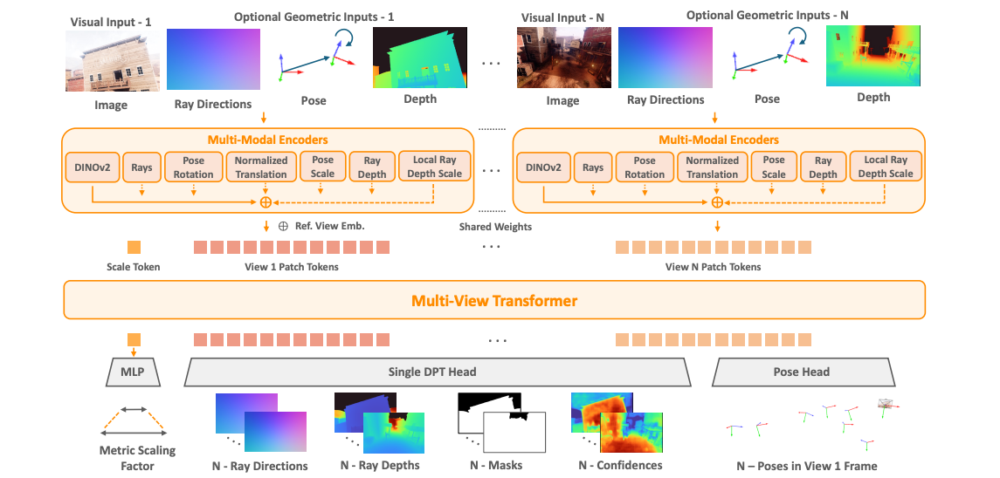
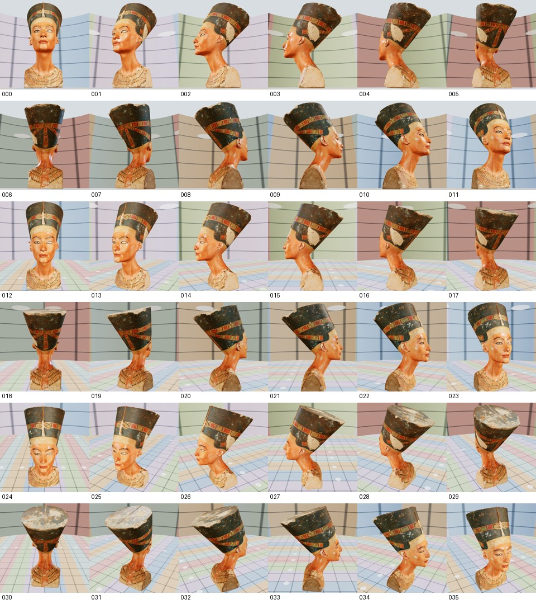
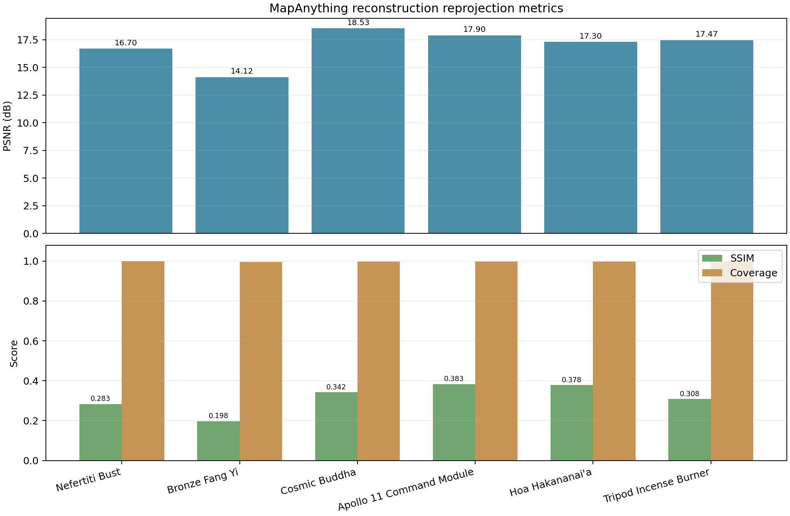

# 计算机图形学课程设计报告

## —— 三维虚拟物体的场景图像内容增强

---

## 目录

- 一、背景与目标
- 二、内容与要求
- 三、实验原理
- 四、总体方案
- 五、程序设计框图
- 六、源程序代码
- 七、实验结果
- 八、心得体会与改进思路

---

## 一、背景与目标

### 1.1 背景

图像的三维重建是计算机视觉与计算机图形学的交叉核心问题。传统方法将重建流程分解为特征检测与匹配、双视图位姿估计、相机标定、光束法平差、多视图立体匹配等多个独立子任务，存在误差累积、流程冗长、泛化能力有限等问题。近年来，基于 Transformer 的前馈式方法展现出统一解决这些子任务的潜力。

另一方面，将三维重建的结果以可交互的 Web 3D 形式呈现给用户，是增强现实领域的重要应用方向。Web 端的三维可视化具有跨平台、零安装、易传播的优势，结合现代 WebGL 技术可以实现高质量的实时渲染效果。

### 1.2 目标

本项目旨在构建一个完整的「离线三维重建 → Web 前端交互展示」系统，具体目标如下：

1. **后端重建**：部署 MapAnything 前馈式三维重建模型，在单卡 NVIDIA A6000 GPU 上实现从多张 RGB 图像到 metric 三维场景的离线重建。
2. **前端展示**：基于 Three.js 构建可交互的 Web 3D 演示页面，将重建得到的三维模型以太阳系轨道的空间叙事方式进行展示，提供旋转、缩放、点击检视、拖拽观察等交互功能。
3. **系统集成**：将后端重建输出（GLB 场景 + 相机参数 JSON）无缝接入前端渲染管线，形成完整的演示系统。

> **项目开源地址**：https://github.com/closss/visual-solar-system

---

## 二、内容与要求

本课程设计要求完成一个包含三维虚拟物体的网页端场景图像内容增强系统，核心要求包括：

| 序号 | 要求 | 本项目实现 |
|------|------|-----------|
| 1 | 三维虚拟物体的创建与加载 | 通过 GLTFLoader 加载 GLB/PLY/STL 格式模型，支持点云和网格两种渲染模式 |
| 2 | 虚拟物体在场景中的放置 | 六件文物沿预设轨道半径分布，以太阳系布局组织空间关系 |
| 3 | 三个及以上虚拟物体的动态关系 | 文物间具有层级轨道关系（太阳-行星），每件文物同时公转与自转 |
| 4 | 沿路径的动态增强 | 文物沿圆形轨道运动，轨道以发光环带可视化呈现 |
| 5 | 网页端可交互性 | OrbitControls 相机控制、点击检视与放大、拖拽旋转观察、响应式布局 |
| 6 | 三维重建后端支撑 | MapAnything 离线重建管线，输出 GLB 点云模型与相机参数 |

---

## 三、实验原理

本系统的实验原理分为两大部分：后端三维重建原理（基于 MapAnything 模型）与前端 WebGL 图形学渲染原理（基于 Three.js 的实时渲染管线）。

---

### 第一部分：后端三维重建原理

#### 3.1 MapAnything 核心思想：因子化场景表示

本项目后端基于 MapAnything 模型。MapAnything 是一种基于 Transformer 的统一前馈式三维重建模型，其核心创新在于提出**因子化的多视图场景几何表示**（Factored Scene Representation）。

与先前工作（如 DUSt3R、VGGT）直接预测稠密点云图（pointmap）不同，MapAnything 将场景分解为语义独立的因子：

给定 $N$ 张输入 RGB 图像以及可选几何先验（相机内参光线 $R$、位姿 $Q, T$、深度 $D$），模型直接回归：

$$f_{\text{MapAnything}}(\hat{\mathcal{I}}, [\hat{\mathcal{R}}, \hat{\mathcal{Q}}, \hat{\mathcal{T}}, \hat{\mathcal{D}}]) = \{m, (R_i, \tilde{D}_i, \tilde{P}_i)_{i=1}^N\}$$

其中各因子的含义为：

- **$m \in \mathbb{R}$**：全局 metric 缩放因子。场景中所有视图共享同一个尺度因子，将 up-to-scale 的局部重建统一升级为真实尺度的 metric 重建。
- **$R_i \in \mathbb{R}^{3 \times H \times W}$**：每像素局部光线方向（归一化到单位长度）。该量与场景尺度无关，仅取决于相机内参和像素位置。
- **$\tilde{D}_i \in \mathbb{R}^{1 \times H \times W}$**：沿光线方向的 up-to-scale 深度。深度值仅具有相对意义（"尺度不定"），需与全局尺度因子 $m$ 结合获得真实深度。
- **$\tilde{P}_i \in \mathbb{R}^{4 \times 4}$**：相对于第一帧（参考视图）的 up-to-scale 相机位姿，包含旋转 $Q_i$（单位四元数）和平移 $\tilde{T}_i$。

最终的 metric 三维重建通过以下公式合成：

$$X_i^{\text{metric}} = m \cdot \left(O_i \cdot (R_i \cdot \tilde{D}_i) + \tilde{T}_i\right)$$

其中 $O_i$ 为由四元数 $Q_i$ 转换得到的旋转矩阵。

### 3.2 因子化表示的优势

1. **解耦尺度依赖与尺度无关量**：光线方向 $R_i$ 和旋转 $Q_i$ 与场景尺度无关，可以从任何数据中学习；而深度、平移和全局尺度因子 $m$ 则可以从 metric 或 non-metric 数据中灵活学习。
2. **支持灵活的输入配置**：当部分几何先验（如相机内参、GPS 位姿、深度传感器读数）可用时，可直接作为条件输入；不可用时，模型仍可仅从图像推断全部几何量。
3. **高效的多数据集联合训练**：允许混合使用 metric 标注和 non-metric（up-to-scale）标注的数据集，通过统一的损失函数进行训练。

### 3.3 模型架构



**图 1 MapAnything 模型架构。** 每个视图的 RGB 图像与可选光线、位姿和深度先经过多模态编码器，再由共享权重的多视图 Transformer 融合；DPT、位姿和尺度预测头分别输出光线方向、深度、掩码、置信度、相机位姿及全局 metric 尺度。

MapAnything 由四个主要模块组成，整体结构如下图所示：

**（1）编码模块**

- **图像编码**：采用 DINOv2 ViT-G 作为骨干网络，提取第 24 层归一化 patch 特征，输出维度为 $1536 \times H/14 \times W/14$。与其他预训练方案相比，DINOv2 在下游性能、收敛速度和泛化能力上表现最优。
- **几何量编码**：光线方向和归一化深度通过浅层卷积编码器（含 pixel unshuffle 14× 下采样）投影至与图像特征相同的空间维度。位姿旋转（单位四元数）、平移方向、深度尺度和位姿尺度等全局量通过 4 层 MLP（GeLU 激活）编码为 1536 维特征向量。
- **特征融合**：所有编码后的特征经 Layer Normalization 求和，再经一次 LayerNorm 获得每视图最终编码。

**（2）多视图 Transformer**

使用 16 层交替注意力 Transformer，24 个注意力头，潜在维度 1536，MLP 比率 4。初始权重来自 DINOv2 ViT-G 的最后 16 层。交替注意力机制在自注意力（intra-view）和交叉注意力（inter-view）之间切换，实现跨视图信息融合。在输入 token 中附加一个可学习的全局尺度 token，并为第一帧添加常数嵌入以区分参考视图。

**（3）预测头模块**

- **密集预测头**：使用 DPT（Dense Prediction Transformer）头将多视图 patch token 解码为每像素输出——光线方向 $R_i$、up-to-scale 深度 $\tilde{D}_i$、非歧义掩码 $M_i$ 和置信度 $C_i$。
- **位姿预测头**：基于平均池化的卷积位姿头预测四元数 $Q_i$ 和 up-to-scale 平移 $\tilde{T}_i$。
- **尺度预测头**：可学习尺度 token 通过 2 层 MLP + ReLU + 指数映射预测全局 metric 缩放因子 $m$。

**（4）训练策略**

- 损失函数包含 10 项：点云损失、光线损失、旋转损失、平移损失、深度损失、局部点云损失、尺度损失、法线损失、多尺度梯度匹配损失、掩码损失。
- 对深度、点云和尺度采用 log-space 变换：$f_{\log}(\mathbf{x}) = (\mathbf{x}/\|\mathbf{x}\|) \cdot \log(1 + \|\mathbf{x}\|)$，有效处理场景尺度的大范围变化。
- 输入概率训练：以 0.9 的总概率提供几何输入，每种因子独立以 0.5 概率出现，使单一模型支持 64 种输入组合。
- 训练数据覆盖 13 个高质量数据集（室内、室外、开放场景），采用基于共视性图（covisible >= 25%）的随机游走多视图采样。

### 3.4 本项目的部署配置

我们将 MapAnything 部署在单卡 **NVIDIA A6000（48GB 显存）** 服务器上：

- 操作系统：Ubuntu 22.04
- Python 环境：Conda，Python 3.12
- 深度学习框架：PyTorch + CUDA
- 模型权重：使用官方 Apache 2.0 许可的 `facebook/map-anything-apache`
- 推理参数：输入 6-36 张多视角 RGB 图像，最大维度 518px
- 输出格式：GLB 点云场景 + 相机参数 JSON

---

### 第二部分：前端图形学渲染原理

前端基于 Three.js（WebGL 2.0）实现实时三维渲染，其底层遵循标准图形学渲染管线。以下按管线阶段阐述本系统涉及的核心图形学原理。

#### 3.5 WebGL 渲染管线概述

WebGL 渲染管线是将三维场景数据转换为二维屏幕像素的完整流水线，主要包括以下阶段：

```
顶点数据 (Vertex Buffer)
       │
       ▼
  ┌───────────────┐
  │ Vertex Shader │  顶点变换：模型→世界→相机→裁剪空间
  └──────┬────────┘
         ▼
  ┌───────────────────────┐
  │ 光栅化 (Rasterization) │  图元装配 + 视口变换 + 片段生成
  └──────┬────────────────┘
         ▼
  ┌─────────────────┐
  │ Fragment Shader │  逐像素着色：纹理采样 + 光照计算 + 雾效混合
  └──────┬──────────┘
         ▼
  ┌────────────────┐
  │ Output Merger  │  深度测试 + 模板测试 + 混合 → Frame Buffer
  └────────────────┘
```

Three.js 内部将上述管线封装为高层次的 `Scene` / `Camera` / `Renderer` 抽象。开发者设置材质、光照、几何体和相机参数后，Three.js 自动生成对应的 GLSL Shader 程序并驱动 GPU 执行。

#### 3.6 顶点着色器与坐标变换

顶点着色器（Vertex Shader）的核心任务是将物体的三维顶点坐标从模型局部空间变换到屏幕裁剪空间。这一过程涉及四个连续的矩阵变换：

$$\mathbf{v}_{\text{clip}} = \mathbf{P}_{\text{projection}} \cdot \mathbf{V}_{\text{view}} \cdot \mathbf{M}_{\text{model}} \cdot \mathbf{v}_{\text{local}}$$

- **模型矩阵 $\mathbf{M}_{\text{model}}$**：将顶点从物体局部坐标系变换到世界坐标系。本系统中，每件文物通过 `body.position`（轨道位置）和 `visual.rotation`（自转）构成各自的模型矩阵。
- **视图矩阵 $\mathbf{V}_{\text{view}}$**：将世界坐标系变换到相机坐标系。由 OrbitControls 根据用户的旋转/缩放/平移操作实时计算，本质上是相机位姿的逆矩阵。
- **投影矩阵 $\mathbf{P}_{\text{projection}}$**：将相机坐标系的三维点投影到二维裁剪空间。本系统使用透视投影（`PerspectiveCamera`），其投影矩阵由视场角（FOV = 48°）、宽高比、近裁剪面（0.1）和远裁剪面（80）定义，实现近大远小的透视效果。

#### 3.7 光栅化与片段生成

光栅化（Rasterization）阶段将裁剪空间中的图元（三角形或点）离散化为屏幕上的像素片段。本系统涉及两种光栅化模式：

**（1）三角形光栅化**：网格模型（GLB 的 Mesh 部分）使用经典三角形扫描线光栅化。GPU 对三角形内部的每个像素重心插值生成片段，插值量包括深度值、法线方向、纹理坐标等顶点属性。

**（2）点精灵光栅化**：点云模型使用 `PointsMaterial` 渲染。GPU 将每个点扩展为面向相机的方形精灵（sprite），通过圆形纹理（Canvas 绘制的径向渐变圆）和 alpha 测试实现圆形点渲染：
- `alphaTest: 0.5`：丢弃 alpha < 0.5 的片段，使方形精灵的边角透明化，呈现圆形效果
- `depthWrite: true`：启用深度写入，确保点云之间存在正确的遮挡关系
- `sizeAttenuation: true`：点大小随距离衰减，近大远小

#### 3.8 片段着色器：PBR 材质与光照模型

片段着色器（Fragment Shader）对每个像素计算最终颜色。本系统使用 Three.js 的 `MeshStandardMaterial`，其内部实现了基于物理的渲染（PBR）模型，核心为 Cook-Torrance 微面元 BRDF：

$$f(l, v) = \frac{D(h) \cdot F(v, h) \cdot G(l, v, h)}{4 \cdot (n \cdot l) \cdot (n \cdot v)}$$

其中各项的含义：
- **$D(h)$（法线分布函数）**：描述微面元法线在半角向量 $h$ 方向的分布概率。本系统使用 Trowbridge-Reitz（GGX）分布，由 `roughness` 参数控制高光锐度——roughness 越低，高光越集中，表面越光滑（如青铜器 `roughness: 0.42`）。
- **$F(v, h)$（菲涅尔项）**：描述反射率随观察角度的变化，使用 Schlick 近似。金属材质（`metalness` 接近 1）反射率高，非金属材质反射率低。
- **$G(l, v, h)$（几何遮蔽函数）**：描述微面元之间的自遮挡效应，使用 Smith GGX 模型。

PBR 材质的关键参数：
- **`color`**：基础反照率（albedo），如娜芙蒂蒂半身像使用 `0xd7a372`（暖棕肤色）
- **`metalness`**：金属度，控制漫反射与镜面反射的混合权重。如青铜器 `metalness: 0.28`
- **`roughness`**：粗糙度，控制微面元分布宽度，范围 0（镜面）到 1（完全漫反射）
- **`emissive` + `emissiveIntensity`**：自发光，使物体在无外部光照时仍然可见（如太阳核心 `emissive: 0xff7a18, emissiveIntensity: 1.15`）

全局面元光照（Global Illumination 近似）由环境光 (`AmbientLight`)、半球光 (`HemisphereLight`) 和方向光 (`DirectionalLight`) 共同提供：
- **环境光**：提供场景基础亮度，模拟间接光照。本系统使用 `AmbientLight(0x526070, 0.9)`，偏蓝灰调
- **主方向光**（Key Light）：模拟太阳或聚光灯的主要照明，产生明确的高光和阴影方向
- **轮廓光**（Rim Light）：从侧面或背面补充照明，勾勒物体边缘轮廓

#### 3.9 阴影映射

本系统使用 **PCF 软阴影映射**（Percentage Closer Filtering Soft Shadow Map）实现实时阴影。阴影映射的原理分为两个 Pass：

**Pass 1 —— 深度图生成**：从光源视角渲染场景，将深度值写入阴影贴图（Shadow Map）。本系统中 `sunLight.castShadow = true` 激活点光源的阴影投射，深度贴图分辨率为 1024×1024。

**Pass 2 —— 阴影测试**：从相机视角渲染时，对每个片段的表面点计算其光源空间坐标，查询阴影贴图中对应的深度值。若表面点到光源的距离大于阴影贴图中记录的深度值，则该点处于阴影中。

PCF 软阴影的关键在于对阴影贴图进行**多次邻域采样**（Percentage Closer Filtering），以加权平均的方式计算阴影遮挡比例，使阴影边缘呈现自然的柔和过渡，而非硬边界的二元阴影。本系统使用 `PCFSoftShadowMap`，Three.js 默认在 3×3 或 5×5 邻域内执行 PCF 采样。

雾效（Fog）也在片段着色器末尾计算，通过深度值与雾参数混合片段颜色和雾色：

$$C_{\text{final}} = f \cdot C_{\text{fragment}} + (1 - f) \cdot C_{\text{fog}}$$

其中 $f = e^{-\text{density} \cdot z}$（指数雾），$z$ 为片段深度。本系统设置 `Fog(0x080b0f, 10, 27)`，近端 10 单位处雾开始生效，远端 27 单位处完全融入深色背景。

#### 3.10 ACES 色调映射

渲染器内部以 HDR（高动态范围）线性空间计算所有光照。但由于显示设备仅支持 LDR（低动态范围，sRGB 色域），必须在输出阶段将 HDR 线性值映射到 [0, 1] 范围。

Three.js 的 `ACESFilmicToneMapping` 实现了 ACES（Academy Color Encoding System）的电影级色调映射曲线，在保持高光细节的同时对比度更加柔和。其核心公式为 ACES 拟合多项式：

$$f_{\text{ACES}}(x) = \frac{x \cdot (a \cdot x + b)}{x \cdot (c \cdot x + d) + e}$$

其中 $a, b, c, d, e$ 为 ACES RRT（Reference Rendering Transform）拟合参数。`toneMappingExposure` 参数（本系统中为 1.08）在线性空间先对 HDR 值进行曝光调整，再送入色调映射曲线。

色调映射完成后，还需进行 **sRGB 传递函数**（Gamma ≈ 2.2）编码，以保证在标准显示器上呈现正确的亮度感知。Three.js 通过 `outputColorSpace = THREE.SRGBColorSpace` 自动完成此转换。

#### 3.11 后处理管线

在早期版本（`cosmos-scene.ts`）中，系统还实现了完整的后处理（Post-Processing）管线，使用 Three.js 的 `EffectComposer` 串联多个后处理 Pass：

```
Render Pass → SMAA Pass → UnrealBloom Pass → Output Pass
```

- **RenderPass**：将场景渲染到帧缓冲（离屏渲染目标），而非直接输出到屏幕。
- **SMAAPass**（Subpixel Morphological Anti-Aliasing）：基于图像空间边缘检测的抗锯齿算法。在亮度域检测边缘像素，通过形态学分析确定边缘方向和混合权重，以亚像素精度混合边缘像素，消除锯齿。相比 MSAA（多重采样抗锯齿），SMAA 的性能开销更低。
- **UnrealBloomPass**：辉光（Bloom）效果。首先通过亮度阈值提取场景中的高亮区域，然后进行多级高斯模糊（下采样金字塔 + 上采样合成），最后将模糊后的辉光与原图叠加。参数包括 `strength`（辉光强度）、`radius`（模糊半径）和 `threshold`（亮度阈值）。科学模式使用较低强度（0.58），电影模式提升至 1.15。
- **OutputPass**：将 HDR 帧缓冲的内容应用色调映射和 sRGB 编码后输出到屏幕。根据 Three.js 官方建议，OutputPass 应放在后处理链的末尾。

#### 3.12 轨道动画的数学原理

文物沿圆形轨道的公转运动基于圆的参数方程：

$$\begin{cases} x(t) = r \cdot \cos(\omega \cdot t + \phi_0) \\ z(t) = r \cdot \sin(\omega \cdot t + \phi_0) \end{cases}$$

其中 $r$ 为轨道半径，$\omega$ 为公转角速度，$\phi_0$ 为初始相位。每件文物具有独立的 $r$ 和 $\omega$ 值，初始相位由 `createEvenOrbitPhases` 算法在 $[0, 2\pi)$ 上均匀分配，确保多件文物在各自轨道上不会初始聚集。

探测器（Probe）沿 Catmull-Rom 样条曲线运动，该曲线由四个连续控制点 $P_0, P_1, P_2, P_3$ 定义：

$$C(t) = 0.5 \cdot \begin{bmatrix} 1 & t & t^2 & t^3 \end{bmatrix} \cdot \begin{bmatrix} 0 & 2 & 0 & 0 \\ -1 & 0 & 1 & 0 \\ 2 & -5 & 4 & -1 \\ -1 & 3 & -3 & 1 \end{bmatrix} \cdot \begin{bmatrix} P_0 \\ P_1 \\ P_2 \\ P_3 \end{bmatrix}$$

Catmull-Rom 样条的 C¹ 连续性保证了探测器运动轨迹的光滑性，参数 $t \in [0, 1]$ 时曲线通过中间两个控制点。

#### 3.13 射线拾取的图形学原理

用户点击文物时，系统通过 Raycaster（射线投射）确定点击目标，其原理为：

1. **屏幕坐标 → 世界射线**：将鼠标的屏幕坐标 $(x_s, y_s)$ 转换为归一化设备坐标（NDC），然后通过逆投影矩阵和逆视图矩阵反算出一条从相机原点出发、穿过近裁剪面上该像素位置的世界空间射线：
   $$\mathbf{r}(t) = \mathbf{c} + t \cdot \mathbf{d}, \quad t \geq 0$$
   其中 $\mathbf{c}$ 为相机世界位置，$\mathbf{d}$ 为射线方向。

2. **射线-物体相交测试**：Three.js 的 Raycaster 通过遍历场景树对每个几何体执行射线相交测试。对于三角网格，使用 Möller-Trumbore 算法逐三角形测试；对于点云（`Points`），使用射线-球体相交（以每个点的世界位置为球心、`threshold` 参数为半径）。本系统设置 `Raycaster.params.Points.threshold = 0.1`，扩大了点云的命中判定范围，解决点云密度低导致的点击困难问题。

3. **命中判定**：取所有相交结果中 $t$ 值最小（即离相机最近）的物体作为命中目标，通过 `userData.artifactId` 字段识别被点击的文物。

---

## 四、总体方案

### 4.1 系统架构

系统采用「离线重建 + 前端展示」的两阶段架构：

```
┌───────────────────────────────────────────────┐
│             离线重建阶段（后端）                 │
│                                               │
│  多视角 RGB 图像（6-36 张）                      │
│         │                                     │
│         ▼                                     │
│  MapAnything 前馈推理（A6000 GPU）              │
│         │                                     │
│         ▼                                     │
│  GLB 三维场景 + 相机参数 JSON                    │
│         │                                     │
│         ▼                                     │
│  部署至前端静态资源目录                           │
└────────────────────┬──────────────────────────┘
                     │
                     ▼
┌─────────────────────────────────────────────┐
│              Web 前端展示阶段                 │
│                                             │
│  Three.js WebGLRenderer（透明 Canvas）       │
│         │                                   │
│         ▼                                   │
│  加载 GLB 模型 → 构建太阳系轨道场景             │
│         │                                   │
│         ▼                                   │
│  实时渲染管线（ACES 色调映射 + 阴影 + 雾效）     │
│         │                                   │
│         ▼                                   │
│  用户交互（旋转/缩放/点击检视/拖拽观察）          │
└─────────────────────────────────────────────┘
```

### 4.2 前端模块划分

| 模块 | 入口文件 | 功能 |
|------|---------|------|
| 主展示页面 | `index.html` → `src/main.ts` | 文物太阳系场景，轨道动画，交互检视 |
| 重建结果查看器 | `reconstruction.html` → `src/reconstruction-viewer.ts` | 展示 MapAnything 多视角重建的 GLB 场景 |
| 单物体渲染器 | `object-render.html` → `src/object-render.ts` | 512×512 离线渲染，多视角批量渲染 |
| 数据定义 | `src/data/heritage-artifacts.ts` | 文物元数据、轨道参数、模型路径配置 |
| 轨道布局 | `src/orbit-layout.ts` | 轨道相位均匀分布算法与位置计算 |
| 场景类（早期版本） | `src/core/cosmos-scene.ts` | 口袋宇宙实验台增强场景（含后处理管线） |

### 4.3 技术栈

| 层级 | 技术 | 版本 |
|------|------|------|
| 构建工具 | Vite | 7.1 |
| 编程语言 | TypeScript | 5.9 |
| 3D 引擎 | Three.js | 0.179 |
| 模型加载 | GLTFLoader + DRACOLoader + PLYLoader + STLLoader | Three.js addons |
| 交互控制 | OrbitControls | Three.js addons |
| 截图导出 | html-to-image | 1.11 |
| 测试 | Vitest | 4.1 |

---

## 五、程序设计框图


程序首先从公开三维文物模型生成统一相机分布下的 RGB 图像和二值掩码。MapAnything 根据多视角图像估计每帧深度、相机内外参和有效区域，后处理程序将各视图深度反投影至统一世界坐标系，结合物体掩码过滤背景点并输出 GLB 点云。前端对高点数结果执行确定性降采样，通过 `GLTFLoader` 加载资产，并由轨道布局、动画循环和 Raycaster 交互模块完成最终展示。

---

## 六、源程序代码

### 6.1 场景初始化与渲染管线（main.ts）

以下代码展示了 Three.js 渲染器的初始化，包含透明画布、ACES 色调映射、软阴影和大气雾效的配置：

```typescript
// 创建透明 WebGL 渲染器，叠加在背景图层之上
const renderer = new THREE.WebGLRenderer({
  canvas: solarCanvas,
  antialias: true,
  alpha: true,
  powerPreference: 'high-performance',
});
renderer.outputColorSpace = THREE.SRGBColorSpace;
renderer.toneMapping = THREE.ACESFilmicToneMapping;
renderer.toneMappingExposure = 1.08;
renderer.shadowMap.enabled = true;
renderer.shadowMap.type = THREE.PCFSoftShadowMap;
renderer.setClearColor(0x000000, 0);

// 场景与相机
const scene = new THREE.Scene();
scene.fog = new THREE.Fog(0x080b0f, 10, 27);

const camera = new THREE.PerspectiveCamera(48, 1, 0.1, 80);
camera.position.set(0, 8.2, 15.5);

// OrbitControls 相机交互
const controls = new OrbitControls(camera, solarCanvas);
controls.enableDamping = true;
controls.dampingFactor = 0.07;
controls.minDistance = 5;
controls.maxDistance = 28;
controls.target.set(0, 0, 0);

// 光照系统：环境光 + 点光源（带阴影） + 补光
scene.add(new THREE.AmbientLight(0x526070, 0.9));
const sunLight = new THREE.PointLight(0xffdf9a, 820, 35, 1.7);
sunLight.castShadow = true;
sunLight.shadow.mapSize.set(1024, 1024);
scene.add(sunLight);
const rimLight = new THREE.DirectionalLight(0x8bdcff, 2.2);
rimLight.position.set(-7, 9, 6);
scene.add(rimLight);
```

**设计说明**：渲染器采用透明背景 (`alpha: true`)，使 3D 画布叠放在星空背景图之上。ACES Filmic 色调映射提供电影级的光照过渡。指数雾效在距相机 10-27 单位范围内逐渐将远处物体融入深色背景，营造深邃太空感。三点布光（环境光 + 主光 + 轮廓光）确保文物模型在任何角度都有良好的立体感和材质表现。

### 6.2 星空粒子系统（main.ts）

```typescript
function createStarField(): THREE.Points {
  const starCount = 900;
  const positions = new Float32Array(starCount * 3);
  const colors = new Float32Array(starCount * 3);
  for (let i = 0; i < starCount; i += 1) {
    const radius = 28 + Math.random() * 32;
    const theta = Math.random() * Math.PI * 2;
    const phi = Math.acos(THREE.MathUtils.randFloatSpread(2));
    positions[i * 3] = radius * Math.sin(phi) * Math.cos(theta);
    positions[i * 3 + 1] = radius * Math.cos(phi) * 0.68 + 3;
    positions[i * 3 + 2] = radius * Math.sin(phi) * Math.sin(theta);
    const warmth = Math.random();
    colors[i * 3] = 0.72 + warmth * 0.24;
    colors[i * 3 + 1] = 0.78 + warmth * 0.18;
    colors[i * 3 + 2] = 0.9 + Math.random() * 0.1;
  }
  const geometry = new THREE.BufferGeometry();
  geometry.setAttribute('position', new THREE.BufferAttribute(positions, 3));
  geometry.setAttribute('color', new THREE.BufferAttribute(colors, 3));
  return new THREE.Points(
    geometry,
    new THREE.PointsMaterial({
      size: 0.055, sizeAttenuation: true,
      vertexColors: true, transparent: true,
      opacity: 0.86, depthWrite: false,
    }),
  );
}
scene.add(createStarField());
```

**设计说明**：星空粒子分布在一个球壳区域（半径 28-60 单位），通过球坐标随机采样生成。每个粒子具有独立的颜色（略微偏向暖白），模拟真实星空的色温变化。`depthWrite: false` 确保星空始终在远景中可见而不遮挡轨道物体。`sizeAttenuation: true` 使远处的星星更小，增强深度感。

### 6.3 轨道系统与动画循环（main.ts + orbit-layout.ts）

**轨道相位分配**（orbit-layout.ts）—— 保证多件文物在各自轨道上均匀分布，避免初始位置重叠：

```typescript
// orbit-layout.ts
export function createEvenOrbitPhases(count: number, startPhase = 0.35): number[] {
  if (count <= 0) return [];
  const step = (Math.PI * 2) / count;
  return Array.from({ length: count }, (_, index) => startPhase + index * step);
}

export function getOrbitPosition(radius: number, phase: number): { x: number; z: number } {
  if (radius === 0) return { x: 0, z: 0 };
  return { x: Math.cos(phase) * radius, z: Math.sin(phase) * radius };
}
```

**轨道可视化**（main.ts）—— 每个轨道用发光环带和细线可视化：

```typescript
function createOrbitTrack(radius: number, color: number): THREE.Group {
  const track = new THREE.Group();
  const points: THREE.Vector3[] = [];
  for (let i = 0; i <= 160; i += 1) {
    const a = (i / 160) * Math.PI * 2;
    points.push(new THREE.Vector3(Math.cos(a) * radius, 0, Math.sin(a) * radius));
  }
  const line = new THREE.Line(
    new THREE.BufferGeometry().setFromPoints(points),
    new THREE.LineBasicMaterial({ color, transparent: true, opacity: 0.72 }),
  );
  const band = new THREE.Mesh(
    new THREE.RingGeometry(radius - 0.025, radius + 0.025, 192),
    new THREE.MeshBasicMaterial({
      color, transparent: true, opacity: 0.22,
      depthWrite: false, side: THREE.DoubleSide,
    }),
  );
  band.rotation.x = Math.PI / 2;
  track.add(band, line);
  return track;
}
```

**动画循环**（main.ts）—— 每帧更新所有文物的公转和自转：

```typescript
function animate(): void {
  const delta = Math.min(clock.getDelta(), 0.033);  // 帧率保护
  for (const item of bodies) {
    if (!isInspecting) {
      // 公转：沿圆形轨道运动
      if (item.artifact.orbitRadius > 0) {
        item.orbitPhase += item.artifact.orbitSpeed * delta;
        const position = getOrbitPosition(item.artifact.orbitRadius, item.orbitPhase);
        item.body.position.set(position.x, 0, position.z);
      }
      // 自转：绕自身轴旋转
      if (item.artifact.spinSpeed > 0) {
        item.visual.rotation.y += item.artifact.spinSpeed * delta;
      }
    }
    // 选中状态的缩放平滑过渡
    const target = selected?.id === item.artifact.id ? 3.15 : 1;
    scaleTarget.set(target, target, target);
    item.body.scale.lerp(scaleTarget, 0.08);
  }
  // 检视模式下的相机平滑推进
  if (isInspecting && selected) {
    // ...相机 lerp 至目标文物近旁...
  }
  controls.update();
  renderer.render(scene, camera);
  requestAnimationFrame(animate);
}
```

**设计说明**：动画系统采用帧率无关的 delta 时间驱动，`Math.min(delta, 0.033)` 防止卡顿后的跳帧。公转通过 `cos/sin` 计算圆形轨道位置；自转通过 `rotation.y` 累积实现。选中文物时通过 `lerp` 实现平滑缩放过渡（系数 0.08 提供自然的缓入缓出）。检视模式下动画暂停，相机平滑推进至目标文物近旁，用户可以拖拽旋转观察。

### 6.4 模型加载与渲染模式（main.ts）

支持 GLB（点云/网格）、PLY、STL 和程序化生成四种模型来源：

```typescript
async function loadModel(artifact: HeritageArtifact): Promise<THREE.Group> {
  // 程序化生成（无模型文件时的兜底方案）
  if (artifact.model.kind === 'procedural') {
    const procedural = createProcedural(artifact);
    normalizeObject(procedural, artifact.model.size);
    tagObject(procedural, artifact);
    return procedural;
  }
  // GLB 格式（支持 Draco 压缩）
  if (artifact.model.kind === 'glb') {
    const gltf = await new GLTFLoader().loadAsync(artifact.model.path ?? '');
    const group = gltf.scene;
    if (artifact.model.representation === 'point-cloud') {
      stylePointCloud(group, artifact);  // 点云渲染模式
    }
    // ...材质赋值与归一化...
    return group;
  }
  // PLY / STL 格式
  const geometry = await new Promise<THREE.BufferGeometry>((resolve, reject) => {
    const loader = artifact.model.kind === 'ply' ? new PLYLoader() : new STLLoader();
    loader.load(artifact.model.path ?? '', resolve, undefined, reject);
  });
  geometry.computeVertexNormals();
  const mesh = new THREE.Mesh(geometry, makeMaterial(artifact));
  // ...归一化与标签...
  return group;
}
```

**设计说明**：模型加载采用策略模式，根据 `kind` 字段自动选择加载器。GLB 模型进一步区分 `representation` 属性：`point-cloud` 表示点云（使用圆形 sprite 纹理 + `PointsMaterial` 渲染），否则为三角网格。所有模型加载后统一进行 `normalizeObject`（缩放至目标尺寸 + 居中），确保不同来源的模型在场景中视觉一致。

### 6.5 交互系统：点击检视与拖拽旋转（main.ts）

```typescript
// Raycaster 射线检测，支持点云拾取
const raycaster = new THREE.Raycaster();
raycaster.params.Points.threshold = 0.1;

// 获取鼠标命中的文物
function getHitBody(event: PointerEvent): OrbitBody | null {
  const rect = solarCanvas.getBoundingClientRect();
  pointer.x = ((event.clientX - rect.left) / rect.width) * 2 - 1;
  pointer.y = -((event.clientY - rect.top) / rect.height) * 2 + 1;
  raycaster.setFromCamera(pointer, camera);
  const hits = raycaster.intersectObjects(scene.children, true);
  const hit = hits.find((entry) => entry.object.userData.artifactId);
  if (!hit) return null;
  return findBody(hit.object.userData.artifactId) ?? null;
}

// 点击：进入检视模式
solarCanvas.addEventListener('pointerdown', (event) => {
  const hitBody = getHitBody(event);
  if (!hitBody) return;

  if (isInspecting && selected?.id === hitBody.artifact.id) {
    // 检视模式下点击已选中文物 → 进入拖拽旋转
    draggedBody = hitBody;
    lastPointerX = event.clientX;
    lastPointerY = event.clientY;
    solarCanvas.classList.add('dragging');
    solarCanvas.setPointerCapture(event.pointerId);
    return;
  }
  selectArtifact(hitBody.artifact.id);
});

// 拖拽移动：旋转文物
solarCanvas.addEventListener('pointermove', (event) => {
  if (!draggedBody) return;
  const dx = event.clientX - lastPointerX;
  const dy = event.clientY - lastPointerY;
  draggedBody.visual.rotation.y += dx * 0.012;
  draggedBody.visual.rotation.x += dy * 0.008;
  lastPointerX = event.clientX;
  lastPointerY = event.clientY;
});

// 释放：退出拖拽
solarCanvas.addEventListener('pointerup', (event) => {
  if (!draggedBody) return;
  draggedBody = null;
  solarCanvas.classList.remove('dragging');
  solarCanvas.releasePointerCapture(event.pointerId);
});
```

**设计说明**：交互分为两个层级。第一层：在全局太阳系视图中点击任意文物进入检视模式（相机推进、文物放大、面板更新）。第二层：在检视模式下再次点击已选中的文物进入拖拽旋转模式，用户可拖动鼠标从任意角度观察文物细节。`Raycaster.params.Points.threshold = 0.1` 扩大了点云模型的命中范围，解决点云难以精确点击的问题。`setPointerCapture` 确保拖拽过程中鼠标移出画布也不会丢失交互状态。

### 6.6 文物数据配置（heritage-artifacts.ts）

每件文物以声明式数据结构定义，包含展示元数据和轨道运动参数：

```typescript
export interface HeritageArtifact {
  id: string;
  orbitRole: string;       // 太阳系角色（太阳/水星/金星/...）
  title: string;           // 文物名称
  subtitle: string;        // 副标题
  period: string;          // 年代
  body: string;            // 描述正文
  details: string[];       // 关键细节列表
  image?: string;          // 参考图片路径
  source: string;          // 馆藏来源
  model: {
    kind: HeritageModelKind;       // glb / ply / stl / procedural
    path?: string;                 // 模型文件路径
    representation?: 'mesh' | 'point-cloud';
    pointSize?: number;
    pointCount?: number;
    color: number;                 // 主题色
    accent: number;                // 高光/轨道色
    size: number;                  // 目标缩放尺寸
  };
  orbitRadius: number;     // 轨道半径（0 表示中心天体）
  orbitSpeed: number;      // 公转速度
  spinSpeed: number;       // 自转速度
}
```

**设计说明**：通过声明式数据驱动整个场景的构建，每件文物的视觉表现、物理运动和文本信息全部由数据配置决定。轨道参数（半径、公转速度、自转速度）参照太阳系行星的物理直觉——内层轨道速度快于外层，增强空间层次感。

### 6.7 重建结果查看器（reconstruction-viewer.ts）

独立的 MapAnything 重建结果验证页面，展示 ScanNet 场景的 6 视角重建输出：

```typescript
// 加载 GLB 重建模型
new GLTFLoader().load(
  modelPath,
  async (gltf) => {
    const model = gltf.scene;
    scene.add(model);
    frameObject(model);   // 自动适配相机到模型包围盒

    const cameras = await fetch(cameraPath).then((response) => response.json());
    status.textContent = `已加载：${cameras.length} 个估计相机，GLB 可旋转查看`;
  },
  undefined,
  (error) => {
    status.textContent = '加载失败：请确认 GLB 文件存在';
  },
);

// 自适应包围盒：根据模型尺寸自动调整相机参数
function frameObject(object: THREE.Object3D): void {
  const box = new THREE.Box3().setFromObject(object);
  const size = box.getSize(new THREE.Vector3());
  const center = box.getCenter(new THREE.Vector3());
  const radius = Math.max(size.x, size.y, size.z) || 1;

  controls.target.copy(center);
  camera.near = Math.max(radius / 1000, 0.001);
  camera.far = radius * 100;
  camera.position.copy(center).add(
    new THREE.Vector3(radius * 0.75, radius * 0.45, radius * 1.35)
  );
  camera.updateProjectionMatrix();
  controls.update();
}
```

**设计说明**：`frameObject` 函数通过计算模型的包围盒（Bounding Box）自动适配相机参数——近/远裁剪面基于包围盒半径动态设置，相机初始位置根据模型尺度按比例偏移，确保任意尺寸的重建结果都能完整显示在视口中。

---

## 七、实验结果

### 7.1 多视角输入

本项目对模型采用统一环绕采样。Nefertiti、Apollo 11 Command Module、Hoa Hakananai'a 和 Tripod Incense Burner 使用 36 个视角，采样由 3 个俯仰角（-20°、0°、20°）和每层 12 个方位角组成；青铜方彝和 Cosmic Buddha 使用 12 个水平环绕视角。统一采样可以覆盖正面、侧面、背面和俯视区域，减少单视角输入导致的平面塌缩与背面缺失。



**图 2 Nefertiti Bust 的 36 视角 RGB 输入阵列。** 视角 000-011 为水平环绕，012-023 和 024-035 分别提供不同俯仰角下的环绕观察。背景中的网格和色块也为跨视角相机估计提供了稳定特征。

### 7.2 重建评测协议

为了量化六件文物的重建结果，本项目采用**输入视角重投影一致性评测**。评测程序读取 MapAnything 输出的点云和 `cameras.json`，使用相机内参 $K$ 与位姿矩阵的逆变换将世界坐标点投影回各输入视图，并通过 z-buffer 保留每个像素最近的点。36 视角资产使用渲染阶段生成的物体掩码；12 视角资产根据纯色背景差异提取前景区域。

设物体掩码与有效投影像素的交集为 $\Omega$，RGB 均方误差和峰值信噪比分别为：

$$
\operatorname{MSE} = \frac{1}{3|\Omega|}
\sum_{p \in \Omega}\left\|I(p)-\hat{I}(p)\right\|_2^2
$$

$$
\operatorname{PSNR} = 10\log_{10}\frac{255^2}{\operatorname{MSE}}
$$

SSIM 使用 $11\times11$ 高斯窗口计算局部亮度、对比度和结构相似度，并在 $\Omega$ 上取均值。覆盖率定义为有效投影像素占物体掩码像素的比例：

$$
\operatorname{Coverage} = \frac{|\Omega|}{|M_{\text{object}}|}
$$

需要说明的是，该协议使用参与重建的输入视角，因此衡量的是**几何覆盖和颜色重投影一致性**，不是留出视角的新视角合成性能。点云颜色来自多个视图，且没有 NeRF 或 Gaussian Splatting 的视角相关颜色模型，因此 PSNR/SSIM 会受到跨视角色差、遮挡冲突和离散点光栅化影响。

### 7.3 六件文物的定量结果

**表 1 六件文物的输入视角重投影指标。** PSNR、SSIM 与 Coverage 均为所有输入视角的算术平均值；后三项数值越高越好。

| 文物 | 视角数 | 原始点数 | 原始 GLB / MB | PSNR / dB ↑ | SSIM ↑ | Coverage ↑ |
|---|---:|---:|---:|---:|---:|---:|
| Nefertiti Bust | 36 | 3,093,510 | 47.20 | 16.70 | 0.283 | 99.97% |
| 青铜方彝 | 12 | 470,992 | 7.19 | 14.12 | 0.198 | 99.56% |
| Cosmic Buddha | 12 | 491,779 | 7.50 | **18.53** | 0.342 | 99.76% |
| Apollo 11 Command Module | 36 | 2,374,024 | 36.23 | 17.90 | **0.383** | 99.73% |
| Hoa Hakananai'a | 36 | 1,609,897 | 24.57 | 17.30 | 0.378 | 99.81% |
| Tripod Incense Burner | 36 | 1,574,455 | 24.03 | 17.47 | 0.308 | 99.84% |
| **平均值** | 28 | 1,602,443 | 24.45 | **17.00** | **0.315** | **99.78%** |



**图 3 六件文物的 PSNR、SSIM 与投影覆盖率。** 完整数据同时保存于 `doc/data/reconstruction_metrics.csv` 和 `doc/data/reconstruction_metrics.json`，评测实现位于 `tools/evaluate_heritage_reprojections.py`。

六件资产的平均覆盖率达到 99.78%，说明 MapAnything 估计的相机与稠密几何能够投影覆盖绝大多数物体区域。结合三维页面中的多角度观察，当前结果未再出现早期单视角实验中明显的单面和平面塌缩。颜色指标明显低于覆盖率：平均 PSNR 为 17.00 dB，平均 SSIM 为 0.315，说明当前点云适合表达整体形体，但细纹理还原仍然有限。

Cosmic Buddha 获得最高 PSNR（18.53 dB），其石质表面颜色变化平缓，跨视角颜色冲突较少。Apollo 11 Command Module 和 Hoa Hakananai'a 的 SSIM 最高，表明主体轮廓与大尺度纹理结构较稳定。青铜方彝的 PSNR 和 SSIM 最低，主要原因是器表存在高频纹饰、金属高光、凹槽遮挡与细薄棱脊，而输入仅有 12 个水平环绕视角；这些区域在不同视图中的颜色与可见性变化较大，合并为无视角相关材质的点云后容易产生纹理模糊。

### 7.4 前端交付结果

原始 36 视角点云包含约 157 万至 309 万点，单个 GLB 最大约 47.20 MB。为了保证浏览器加载与交互帧率，前端展示版对四个高点数资产确定性降采样至 40 万点，文件大小约 6.1 MB；青铜方彝和 Cosmic Buddha 保留原始重建点云。最终页面能够同时加载六件文物，支持轨道公转、自转、点击选中、平滑相机推进和拖拽旋转，并在桌面端与移动端保持响应式布局。

---

## 八、心得体会与改进思路

### 8.1 心得体会

通过本次课程设计，我深入理解了三维重建与 Web 3D 可视化的完整技术链路：

1. **三维重建方面**：MapAnything 的因子化场景表示让我认识到「解耦」在深度学习系统中的重要性——将复杂问题分解为独立可学习的子问题（光线方向、深度、位姿、尺度），不仅提高了模型的灵活性（支持 64 种输入组合），还使得混合 metric 和 non-metric 数据联合训练成为可能。

2. **Web 3D 编程方面**：Three.js 提供了完善的 3D 渲染抽象。ACES 色调映射、指数雾效和软阴影的组合能够在浏览器中实现接近离线渲染的视觉质量。声明式的数据驱动架构使得添加新文物模型和调整轨道参数非常便捷。

3. **系统工程方面**：前后端分离的架构设计使得两部分的开发和调试可以独立进行。前端通过 GLB + JSON 的标准化接口与后端解耦，后端模型升级不影响前端代码。

### 8.2 改进思路

1. **实时重建**：当前为离线重建方案，未来可探索服务器端实时推理 + WebSocket 流式传输，让用户上传照片后即时获得三维重建结果。

2. **渲染质量提升**：可引入 Gaussian Splatting 作为备选重建方案，其在透明/半透明表面和复杂几何细节上的表现优于点云；前端可集成 Three.js 的 WebGPURenderer 以利用新一代图形 API。

3. **场景交互增强**：增加文物间的连线标注、时间轴模式切换（按文明时期重新排列轨道）、语音导览等功能，增强教学展示效果。

4. **模型扩展**：当前仅展示 6 件文物，可扩展至更多轨道层级，增加彗星/小行星带等天体元素丰富视觉层次。

5. **性能优化**：对点云模型采用 LOD（Level of Detail）策略，根据相机距离动态调整渲染点数，在移动端获得更好的帧率表现。
